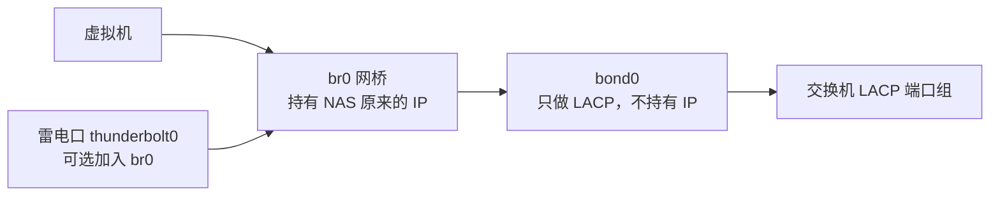

# 绿联 UGOS Pro 双网口 LACP 后桥接虚拟机、固定网关、雷电桥接到聚合口——Windows 小白教程

本文把原来的三篇个人操作笔记整理成一篇给新手照着做的教程，为方便无运维经验读者跟随处理，特使用 Windows 电脑，通过 SSH 登录 NAS 操作。

> 高风险提醒  
> 此项并非系统自带功能，官方明确通过SSH修改不提供技术支持，因此相关功能可能在后续更新中移除，建议完整阅读后认真操作，确保相关内容正确执行，避免数据损失，按照本教程指引操作，视为个人愿意承担相关风险。本教程会修改 NAS 网络配置。如果不慎配错，UGOS 页面和 SSH 都可能连不上。因为UGOS的HDMI不支持桌面功能，开始前建议小白读者确认可以用雷电直连重新连回 NAS，以备在配错时可以连回NAS回滚数据。没有雷电直连通道时，如果配错需要按住reset按键重置网络配置，造成部分配置需要重新处理，比较耗时。

> 重要限制  
> 使用本文方案后，虚拟机网卡会改成手工桥接 `br0`。后续将不能在 UGOS UI 界面配置网络设置，也不能在UGOS虚拟机UI编辑相关虚拟机的网络设置。以后要改虚拟机网络，需要继续用 SSH 和 `virsh edit`。

## 最终效果

改造前：


改造后：



简单来说：

| 对象 | 修改前 | 修改后 |
| --- | --- | --- |
| `bond0` | 有 NAS 的 IP、网关、DNS | 只负责双网口 LACP |
| `br0` | 不存在 | 持有 NAS 原来的 IP、网关、DNS |
| 虚拟机 | 通过libvrt管理，只能选 NAT / 仅主机 | 直接桥接到 `br0`，像普通局域网设备一样联网 |
| 雷电口 | 分配单独雷电 IP | 可选加入 `br0`，直接DHCP获得NAS所在局域网IP |

## 开始前必须确认

任意一项不满足都建议确认后再做：

- NAS 当前就是通过聚合口上网。（即：NAS 已经在 UGOS Pro 里创建双网口 LACP / 802.3ad / 动态链路聚合。交换机已经创建对应的 LACP 端口组，并且两根 NAS 网线都在同一个端口组。）
- 当前没有重要文件传输、虚拟机写盘、备份任务正在运行。

## 示例参数

本文用下面参数举例。你必须换成自己的真实值。

| 参数 | 示例 |
| --- | --- |
| NAS 管理员用户名 <br>（可在控制面板查看） | `admin` |
| NAS 当前 IP | `192.168.166.100` |
| 默认网关 | `192.168.166.1` |
| 子网掩码 | `255.255.255.0` |
| DNS | `223.5.5.5 223.6.6.6` |
| bond MAC | `6c:1f:xx:xx:xx:xx` |
| 聚合成员 | `eth0 eth1` |

**后文所有 IP、DNS、MAC 地址都只是示例，不要原样照抄。**

## 第 1 步：Windows 上确认能访问 NAS

在 Windows 上按 `Win + X`，打开“终端”或“Windows PowerShell”。

### 1.1 查看 Windows 自己的网络信息

在 Windows PowerShell 执行：

```powershell
ipconfig
```

预期输出示例：

```text
IPv4 地址 . . . . . . . . . . . . : 192.168.166.20
子网掩码  . . . . . . . . . . . . : 255.255.255.0
默认网关. . . . . . . . . . . . . : 192.168.166.1
```

解释：

- Windows 的 IPv4 地址和 NAS IP 通常应该在同一个网段，例如都是 `192.168.166.x`。
- 默认网关一般是路由器 IP，后面要写进 `br0` 配置。
- 如果你看不懂哪块网卡正在联网，先不要继续。

### 1.2 测试 Windows 能 ping 到 NAS

在 Windows PowerShell 执行：

```powershell
ping 192.168.166.100
```

预期输出示例：

```text
来自 192.168.166.100 的回复: 字节=32 时间<1ms TTL=64
来自 192.168.166.100 的回复: 字节=32 时间<1ms TTL=64
```

解释：

- 能看到“来自 ... 的回复”，说明 Windows 现在能访问 NAS。
- 如果显示“请求超时”或“无法访问目标主机”，先解决基础网络问题，不要继续改 NAS 配置。

## 第 2 步：确认雷电救援连接可用

这一步不是可选项。因为机器HDMI没法进入终端，配坏网络后只能靠雷电直连救回来，否则就要用reset按键重置全部网络设置。

用雷电线连接 Windows 电脑和 NAS 后，在 Windows PowerShell 执行：

```powershell
ipconfig
```

预期输出示例：

```text
以太网适配器 Thunderbolt Networking:
   IPv4 地址 . . . . . . . . . . . . : 169.254.10.20
   子网掩码  . . . . . . . . . . . . : 255.255.0.0
```

解释：

- Windows 里应该出现一个雷电 / Thunderbolt / USB4 相关网卡。
- 这一步只证明 Windows 识别到了雷电网卡，不代表一定能救援。

继续测试能否通过雷电 IP 登录 NAS。把下面 IP 换成你记录的 NAS 雷电 IP，admin换成你的NAS管理员用户名。

```powershell
ssh admin@169.254.10.10
```

预期输出示例：

```text
admin@169.254.10.10's password:
```

解释：

- 出现密码提示，说明雷电直连 SSH 通道大概率可用。
- 如果连不上，请先把雷电救援搞定。没有救援通道时，reset之后要重新配置的东西太多。
- 本文后面统一用 `admin` 表示 NAS 管理员用户名，请换成你自己的管理员用户。

## 第 3 步：用管理员用户 SSH 登录 NAS

首先确认UGOS UI界面中，控制面板，终端机中的SSH已启用，端口设置为22，自动关闭设置为长期有效。
本文后面统一用 `admin` 表示 NAS 管理员用户名，请换成你自己的管理员用户。`192.168.166.100`表示NAS的IP地址，请换成你自己的NAS IP。 

在 Windows PowerShell 执行：

```powershell
ssh admin@192.168.166.100
```

预期输出示例：

```text
admin@192.168.166.100's password:
```

按照提示输入NAS用户的密码

- 输入管理员用户密码时，屏幕上不会显示星号，也不会显示圆点，这是正常的。输入完直接按回车。

登录后，在 NAS SSH 执行：

```sh
sudo -i
```

预期输出示例：

```text
[sudo] password for admin:
root@UGREEN:~#
```

注意：

- 这里输入的仍然是管理员用户 `admin` 的NAS用户密码，不是另一个新密码。
- 输入密码时同样不会回显。
- 看到提示符变成 `root@...#`，说明已经切到 root。

确认当前身份，在 NAS SSH 执行：

```sh
whoami
```

预期输出：

```text
root
```

注意：

- 必须输出 `root` 才能继续。
- 如果输出的是管理员用户名，说明还没有成功 `sudo -i`，不要继续修改网络文件。

## 第 4 步：只查看当前网络配置

这一节只看，不改，建议没有经验的人还是先看一遍现有配置再更改，避免配错。

### 4.1 查看接口和 IP

在 NAS SSH 执行如下命令，查看当前桥接情况。

```sh
ip -br addr
```

预期输出示例：

```text
eth0             UP
eth1             UP
bond0            UP             192.168.166.100/24
```

注意：

- 除了这三个接口外，可能还会有lo、virbr0、docker0、vnet等多个接口，我们只需要查看 `bond0` 是否持有IP（即bond0后面是否有写IP地址）。
- 如果 NAS IP 不在 `bond0` 上，说明你的环境和本文不一致，可以在本文下面留言讨论，不要继续操作了。

### 4.2 查看默认路由

在 NAS SSH 执行：

```sh
ip route
```

预期输出示例：

```text
default via 192.168.166.1 dev bond0
192.168.166.0/24 dev bond0 proto kernel scope link src 192.168.166.100
```

解释：

- `default via 192.168.166.1` 表示默认网关是 `192.168.166.1`，对一般无经验用户而言，应该和你在Windows上查询到的一致。
- `dev bond0` 表示当前默认路由走 `bond0`。
- 改完重启网络后，默认网关会丢失，这是UGOS系统希望自动加载网关，但我们手动修改了 `bond0` 的必然现象。后面会手动加回，并用 systemd 固定。

### 4.3 查看主配置入口

在 NAS SSH 执行：

```sh
cat /etc/network/interfaces
```

预期输出示例：

```text
# This file describes the network interfaces available on your system
# and how to activate them. For more information, see interfaces(5).

source /etc/network/interfaces.d/ifcfg-*

# The loopback network interface
auto lo
iface lo inet loopback
```

解释：

- 这说明 UGOS 的网卡配置主要在 `/etc/network/interfaces.d/` 目录下。本教程后面只改这个目录里的配置文件。

### 4.4 查看 interfaces.d 目录

在 NAS SSH 执行：

```sh
ls -l /etc/network/interfaces.d
```

预期输出示例：

```text
-rw-r----- 1 root root 223 ifcfg-bond0
-rw------- 1 root root   0 .ifcfg-bond0.lock
```

解释：

- 要能看到 `ifcfg-bond0`。
- 如果没有 `ifcfg-bond0`，说明你的系统配置结构不一样，可以在本文下面留言讨论，不要继续操作了。

### 4.5 查看 bond0 配置

在 NAS SSH 执行：

```sh
cat /etc/network/interfaces.d/ifcfg-bond0
```

预期输出示例：

```text
auto bond0
iface bond0 inet static
address 192.168.166.100
netmask 255.255.255.0
gateway 192.168.166.1
dns-nameservers 223.5.5.5 223.6.6.6
hwaddress 6c:1f:f7:XX:XX:XX
bond-slaves eth0 eth1
bond-mode 802.3ad
bond-lacp-rate fast
bond-miimon 100
bond-updelay 100
bond-downdelay 0
```

解释：

- `address` 是 NAS 当前 IP。
- `gateway` 是默认网关。
- `dns-nameservers` 是 DNS。
- `hwaddress` 这个是你nas接口对外展示的mac地址。
- `bond-slaves` 指的是bond0聚合的子接口分别是 `eth0 eth1`。

## 第 5 步：备份网络配置


在 NAS SSH 执行如下命令，设置一个变量，告诉后面的命令把备份放在哪里：

```sh
BACKUP_DIR="/root/ugreen-network-backup-before-bridge"
```

预期输出：

```text
没有输出
```

注意：

- 备份目录如果以前用过，可以把名字改成 `/root/ugreen-network-backup-before-bridge-2`。

在 NAS SSH 执行如下命令，创建备份文件夹：

```sh
mkdir -p "$BACKUP_DIR"
```

预期输出：

```text
没有输出
```

注意：

- 如果出现权限错误，说明你不是 root，回到第 3 步。

在 NAS SSH 执行如下命令，把当前网络配置复制到备份目录：

```sh
cp -a /etc/network/interfaces "$BACKUP_DIR/"
```

预期输出：

```text
没有输出
```

在 NAS SSH 执行如下命令，把当前网络配置文件夹复制到备份目录：

```sh
cp -a /etc/network/interfaces.d "$BACKUP_DIR/"
```

预期输出：

```text
没有输出
```

在 NAS SSH 执行如下命令，检查备份情况：

```sh
ls -l "$BACKUP_DIR"
```

预期输出示例：

```text
-rw-r--r-- 1 root root 123 interfaces
drwxr-xr-x 2 root root 4096 interfaces.d
```

注意：

- 看到 `interfaces` 和 `interfaces.d` 才算备份完成。
- 如果没有这两个东西，说明上面的步骤哪里做错了，你将不能舒服的快速回滚更改，再出错就要按reset了。

## 第 6 步：直接修改 bond0 配置

目标：让 `bond0` 只做 LACP，不再持有 IP。

先把下面内容复制到记事本，或者你习惯的文本编辑器（建议用记事本，新手用word等高级文本编辑器经常会忘记全角、半角输入问题，或者被拼写检查、自动完成影响，导致配置有误），执行如下替换：

- `eth0 eth1`：换成你查询到的 `bond-slaves`。
- `6c:1f:f7:xx:xx:xx`：换成你原文件里的 `hwaddress`。

确认替换完成后，在 NAS SSH 执行整段命令，从 `cat >` 到最后的 `EOF` 都要复制：

```sh
cat > /etc/network/interfaces.d/ifcfg-bond0 <<'EOF'
auto bond0
iface bond0 inet manual
    bond-slaves eth0 eth1
    bond-mode 802.3ad
    bond-lacp-rate fast
    bond-miimon 100
    bond-updelay 100
    bond-downdelay 0
    hwaddress 6c:1f:f7:xx:xx:xx
EOF
```

预期输出：

```text
没有输出
```

注意：

- 如果复制后命令卡住，通常是最后一个 `EOF` 没有单独一行。单独输入 `EOF` 再回车即可结束。
- 如果发现写错，先不要重启网络，重新执行本节命令覆盖即可。


## 第 7 步：直接新增 br0 配置

目标：让 `br0` 持有 NAS 原来的 IP、网关和 DNS，并桥接到 `bond0`。

先把下面内容复制到记事本，替换：

- `192.168.166.100`：换成 NAS 当前 IP。
- `255.255.255.0`：换成你的子网掩码。
- `192.168.166.1`：换成你的默认网关。
- `223.5.5.5 223.6.6.6`：换成你的 DNS。

确认替换完成后，在 NAS SSH 执行：

```sh
cat > /etc/network/interfaces.d/ifcfg-br0 <<'EOF'
auto br0
iface br0 inet static
    address 192.168.166.100
    netmask 255.255.255.0
    gateway 192.168.166.1
    dns-nameservers 223.5.5.5 223.6.6.6
    bridge_ports bond0
    bridge_stp off
    bridge_fd 0
iface br0 inet6 dhcp
EOF
```

预期输出：

```text
没有输出
```

解释：

- `bridge_ports bond0` 表示 `br0` 下接 `bond0`，不是直接下接 `eth0 eth1`。
- 如果发现 IP、网关、DNS 写错，先不要重启网络，重新执行本节命令覆盖即可。

创建 `br0` lock 文件，在 NAS SSH 执行：

```sh
touch /etc/network/interfaces.d/.ifcfg-br0.lock
```

预期输出：

```text
没有输出
```

解释：

- 这是为了和 UGOS 目录里已有 lock 文件风格保持一致。

设置 lock 文件权限，在 NAS SSH 执行：

```sh
chmod 0600 /etc/network/interfaces.d/.ifcfg-br0.lock
```

预期输出：

```text
没有输出
```

## 第 8 步：重启网络服务并手动加回默认网关

检查正式 `bond0` 配置，在 NAS SSH 执行：

```sh
cat /etc/network/interfaces.d/ifcfg-bond0
```

预期输出示例：

```text
auto bond0
iface bond0 inet manual
    bond-slaves eth0 eth1
    bond-mode 802.3ad
    bond-lacp-rate fast
    bond-miimon 100
    bond-updelay 100
    bond-downdelay 0
    hwaddress 6c:1f:f7:xx:xx:xx
```

检查要点：

- `iface bond0 inet manual` 表示 `bond0` 不持有 IP。
- 输出里不能再有 `address`、`gateway`、`dns-nameservers`。
- `hwaddress` 必须是你 NAS 原来的 MAC，不要照抄示例。

检查正式 `br0` 配置，在 NAS SSH 执行：

```sh
cat /etc/network/interfaces.d/ifcfg-br0
```

预期输出示例：

```text
auto br0
iface br0 inet static
    address 192.168.166.100
    netmask 255.255.255.0
    gateway 192.168.166.1
    dns-nameservers 223.5.5.5 223.6.6.6
    bridge_ports bond0
    bridge_stp off
    bridge_fd 0
iface br0 inet6 dhcp
```

检查要点：

- `address` 必须是 NAS 原来的 IP。
- `gateway` 必须是路由器 IP，不是 NAS IP。
- `bridge_ports bond0` 必须保留。


确认上述检查通过后，先在 Windows 另开一个 PowerShell 窗口，持续 ping NAS，这样让我们对网络重启的状态心里有数：

```powershell
ping -t 192.168.166.100
```

预期输出示例：

```text
来自 192.168.166.100 的回复: 字节=32 时间<1ms TTL=64
```

注意：

- 这个窗口不要关。
- 下面运行重启网络时可能会丢包，用它观察 NAS 何时恢复。

在 NAS SSH 执行，我们要使配置生效了：

```sh
systemctl restart networking.service
```

预期输出：

```text
通常没有输出；SSH 可能卡住或断开
```

等 3 到 5 分钟，看另一个窗口的 `ping -t` 是否恢复，恢复为 `来自 192.168.166.100 的回复: 字节=32 时间<1ms TTL=64` 这个格式了，就可以执行下一步了。如果上面的检查都正确，但网络还是长时间不恢复，用第2步的方式连接雷电线确认雷电IP连接SSH先试一下下面的网关手动添加好不好使，不好使的话需要回滚。

网络恢复后，在 Windows PowerShell 执行：

```powershell
ssh admin@192.168.166.100
```

预期输出示例：

```text
admin@192.168.166.100's password:
```

解释：

- 能看到密码提示，说明 NAS 原 IP 已恢复访问。
- 登录后仍然要执行 `sudo -i` 切到 root。

在 NAS SSH 执行：

```sh
sudo -i
```

预期输出示例：

```text
[sudo] password for admin:
root@UGREEN:~#
```

查看接口桥接状态，在 NAS SSH 执行：

```sh
ip -br addr
```

预期输出示例：

```text
eth0             UP
eth1             UP
bond0            UP
br0              UP             192.168.166.100/24
```

注意：

- 这里可能还是会有很多其他接口，不要紧，我们只需要关注：`br0` 应该持有 NAS IP，同时`bond0` 不应该再持有 NAS IP。

查看路由，在 NAS SSH 执行：

```sh
ip route
```

预期输出示例：

```text
192.168.166.0/24 dev br0 proto kernel scope link src 192.168.166.100
```

解释：

- 这时大概率没有 `default via ...`，也就是默认网关丢失。
- 这是预期现象，不要慌，直接执行下一条命令。

手动加回默认网关，在 NAS SSH 执行：

```sh
ip route add default via 192.168.166.1 dev br0
```

预期输出：

```text
没有输出
```

解释：

- 把 `192.168.166.1` 换成你的默认网关。
- 没有输出表示添加成功。
- 如果提示 `File exists`，说明默认路由已经存在，可以继续后面的检查。

再次查看路由，在 NAS SSH 执行：

```sh
ip route
```

预期输出示例：

```text
default via 192.168.166.1 dev br0
192.168.166.0/24 dev br0 proto kernel scope link src 192.168.166.100
```

解释：

- 现在必须看到 `default via 网关 dev br0`。
- 如果看不到，说明默认网关没有加成功，你可能需要回滚了。


测试网关，在 NAS SSH 执行：

```sh
ping -c 3 192.168.166.1
```

预期输出示例：

```text
64 bytes from 192.168.166.1: icmp_seq=1 ttl=64 time=1.0 ms
64 bytes from 192.168.166.1: icmp_seq=2 ttl=64 time=1.0 ms
64 bytes from 192.168.166.1: icmp_seq=3 ttl=64 time=1.0 ms
```

解释：

- 把 IP 换成你的默认网关。
- 能通说明 NAS 到路由器正常。

测试外网 IP，在 NAS SSH 执行：

```sh
ping -c 3 223.5.5.5
```

预期输出示例：

```text
64 bytes from 223.5.5.5: icmp_seq=1 ttl=50 time=10 ms
64 bytes from 223.5.5.5: icmp_seq=2 ttl=50 time=10 ms
64 bytes from 223.5.5.5: icmp_seq=3 ttl=50 time=10 ms
```

解释：

- 能通说明默认网关和外网路径正常。

## 第 9 步：用 systemd 固定默认网关

因为重启后默认网关会丢，所以要创建 systemd 服务，让 NAS 每次启动后自动执行：

```text
ip route add default via 网关 dev br0
```

把下面的 `192.168.166.1` 换成你的默认网关，然后在 NAS SSH 执行整段：

```sh
cat > /etc/systemd/system/force-br0-gateway.service <<'EOF'
[Unit]
Description=Force default gateway through br0 for UGOS custom bridge
After=network.target network-online.target
Wants=network-online.target

[Service]
Type=oneshot
ExecStartPre=/bin/sleep 15
ExecStart=-/sbin/ip route add default via 192.168.166.1 dev br0
RemainAfterExit=yes

[Install]
WantedBy=multi-user.target
EOF
```

预期输出：

```text
没有输出
```

注意：

- `ExecStart=` 里的网关必须换成你的真实网关。

查看服务文件，在 NAS SSH 执行：

```sh
cat /etc/systemd/system/force-br0-gateway.service
```

预期输出示例：

```text
[Unit]
Description=Force default gateway through br0 for UGOS custom bridge
After=network.target network-online.target
Wants=network-online.target

[Service]
Type=oneshot
ExecStartPre=/bin/sleep 15
ExecStart=-/sbin/ip route add default via 192.168.166.1 dev br0
RemainAfterExit=yes

[Install]
WantedBy=multi-user.target
```

解释：

- 肉眼确认 `ExecStart=` 这一行里的网关正确。
- 如果你家网关不是 `192.168.166.1`，这里就不应该出现 `192.168.166.1`。

重新加载 systemd，在 NAS SSH 执行：

```sh
systemctl daemon-reload
```

预期输出：

```text
没有输出
```

启用开机自启，在 NAS SSH 执行：

```sh
systemctl enable force-br0-gateway.service
```

预期输出示例：

```text
Created symlink /etc/systemd/system/multi-user.target.wants/force-br0-gateway.service -> /etc/systemd/system/force-br0-gateway.service.
```

## 第 10 步：把虚拟机改成桥接 br0

建议先只改一台不重要的测试虚拟机。

### 10.1 查看虚拟机列表

在 NAS SSH 执行：

```sh
virsh list --all
```

预期输出示例：

```text
 Id   Name                                   State
------------------------------------------------------
 -    xxxxxxxx-xxxx-xxxx-xxxx-xxxxxxxxxxxx   shut off
 1    yyyyyyyy-yyyy-yyyy-yyyy-yyyyyyyyyyyy   running
```

解释：

- `Name` UGOS的kvm通过UUID存储name，我们在UI里配置的虚拟机名称写在配置文件里，UUID和UI设置的虚拟机名称对应关系下面会教。

先把需要操作的虚拟机UUID放在环境变量里，这样不用每次复制，在 NAS SSH 执行：

```sh
VM_NAME="xxxxxxxx-xxxx-xxxx-xxxx-xxxxxxxxxxxx"
```

预期输出：

```text
没有输出
```

下面查一下UUID和UI设置的虚拟机名称对应关系，在 NAS SSH 执行：

```sh
virsh dumpxml $VM_NAME | grep -E '<name>|<title>' || true
```

预期输出示例：

```text
  <name>xxxxxxxx-xxxx-xxxx-xxxx-xxxxxxxxxxxx</name>
  <title>你在UGOS UI设置的虚拟机名称</title>
```

### 10.2 备份虚拟机配置文件XML

在 NAS SSH 执行，把备份位置装到变量里：

```sh
VM_XML_BACKUP="/root/${VM_NAME}-before-br0.xml"
```

预期输出：

```text
没有输出
```

在 NAS SSH 执行，执行配置文件备份：

```sh
virsh dumpxml "$VM_NAME" > "$VM_XML_BACKUP"
```

预期输出：

```text
没有输出
```


### 10.3 关闭虚拟机

建议先在 UGOS 页面里正常关机。

### 10.4 学会 vi 最小操作

`virsh edit` 默认会打开 `vi`。小白只需要记住下面几个键：

| 动作 | 按键 |
| --- | --- |
| 搜索网卡配置 | 输入 `/interface`，再按回车 |
| 进入编辑模式 | 按 `i` |
| 退出编辑模式 | 按 `Esc` |
| 保存并退出 | 先按 `Esc`，再输入 `:wq`，最后按回车 |
| 不保存退出 | 先按 `Esc`，再输入 `:q!`，最后按回车 |
| 方向移动 | 键盘方向键 |
| 删除光标前字符 | `Backspace` |
| 删除光标所在字符 | 先按 `Esc`，再按 `x` |

注意：

- 刚打开时是普通模式，不能直接输入文字。要先按 `i` 才能编辑。
- 建议切到英文输入法再操作，避免中文输入法把命令符号变掉。
- 如果你发现自己输的内容没有进文件，通常是还没按 `i`。
- 如果文件很长，先输入 `/interface` 回车，快速跳到网卡配置附近。
- 如果改乱了，不要保存，按 `Esc`，输入 `:q!` 回车退出，然后重新执行打开编辑的命令就行。

### 10.5 编辑虚拟机 XML

在 NAS SSH 执行，打开vi文本编辑器：

```sh
virsh edit "$VM_NAME"
```

打开后用方向键找到 `<interface type='network'>` 这一段。

把类似下面内容：

```xml
<interface type='network'>
  <mac address='xx:xx:xx:xx:xx:xx'/>
  <source network='vnet-bridge0'/>
  <model type='virtio'/>
</interface>
```

改成：

```xml
<interface type='bridge'>
  <mac address='xx:xx:xx:xx:xx:xx'/>
  <source bridge='br0'/>
  <model type='virtio'/>
</interface>
```

vi 操作顺序：

1. 用方向键移动到 `type='network'` 附近。
2. 按 `i` 进入编辑模式。
3. 把 `network` 改成 `bridge`。
4. 把 `<source network='vnet-bridge0'/>` 改成 `<source bridge='br0'/>`。注意不要忘记等号前面的network要改成bridge。
5. 按 `Esc` 退出编辑模式。
6. 输入 `:wq` 并按回车保存退出。

### 10.6 重启虚拟机并测试

在 NAS SSH 执行，重启或启动虚拟机，使修改生效：

```sh
virsh reboot "$VM_NAME"
如果已经关机，则为
virsh start "$VM_NAME"
```

预期输出示例：

```text
Domain 'xxxxxxxx-xxxx-xxxx-xxxx-xxxxxxxxxxxx' started
```


## 第 11 步：可选，把雷电口加入 br0

当上述内容测试无误后，可以把雷电口加入br0


查看雷电口状态，在 NAS SSH 执行：

```sh
ip -br addr
```

预期输出示例：

```text
thunderbolt0     UP
br0              UP             192.168.166.100/24
```

注意：

- 看到 `thunderbolt0` 才继续。
- 如果没有 `thunderbolt0`，说明当前机器或当前系统状态不适合做这一节。

先设置备份目录，在 NAS SSH 执行：

```sh
BACKUP_DIR="/root/ugreen-network-backup-before-bridge"
```

预期输出：

```text
没有输出
```

注意：

- 如果第 5 步备份时改过目录名，这里也要改成同一个目录名。

在 NAS SSH 执行如下命令备份原有配置：

```sh
cp -a /etc/network/interfaces.d/ifcfg-thunderbolt0 "$BACKUP_DIR/ifcfg-thunderbolt0.before-br0"
```

预期输出：

```text
没有输出
```

直接写入雷电口配置，在 NAS SSH 执行：

```sh
cat > /etc/network/interfaces.d/ifcfg-thunderbolt0 <<'EOF'
allow-hotplug thunderbolt0
iface thunderbolt0 inet manual
    post-up ip link set thunderbolt0 master br0 || true
    post-up ip link set thunderbolt0 up || true
    pre-down ip link set thunderbolt0 nomaster || true
EOF
```

预期输出：

```text
没有输出
```

查看雷电口配置，在 NAS SSH 执行：

```sh
cat /etc/network/interfaces.d/ifcfg-thunderbolt0
```

预期输出示例：

```text
allow-hotplug thunderbolt0
iface thunderbolt0 inet manual
    post-up ip link set thunderbolt0 master br0 || true
    post-up ip link set thunderbolt0 up || true
    pre-down ip link set thunderbolt0 nomaster || true
```

## 常见问题

### 1. 重启网络后 NAS 原 IP 不通

先等 5 分钟。如果仍然不通：

- 用雷电救援连接 SSH 到 NAS。
- 登录后 `sudo -i`。
- 按“回滚方法”恢复备份。

### 2. NAS 能打开 UGOS，但不能访问外网

在 NAS SSH 执行：

```sh
ip route
```

预期输出示例：

```text
192.168.166.0/24 dev br0 proto kernel scope link src 192.168.166.100
```

解释：

- 如果没有 `default via ... dev br0`，就是默认路由丢了。

手动补默认路由，在 NAS SSH 执行如下命令手动添加网关，然后回到第 9 步检查 systemd 服务。：

```sh
ip route add default via 192.168.166.1 dev br0
```

预期输出：

```text
没有输出
```

## 回滚方法

如果配坏了，用雷电救援连接 SSH 到 NAS，然后 `sudo -i` 切到 root。

设置备份目录，在 NAS SSH 执行：

```sh
BACKUP_DIR="/root/ugreen-network-backup-before-bridge"
```

预期输出：

```text
没有输出
```

解释：

- 如果你备份时改过目录名，这里也要改成对应名字。

查看备份目录，在 NAS SSH 执行：

```sh
ls -l "$BACKUP_DIR"
```

预期输出示例：

```text
-rw-r--r-- 1 root root 123 interfaces
drwxr-xr-x 2 root root 4096 interfaces.d
```

解释：

- 必须看到 `interfaces` 和 `interfaces.d`。
- 看不到就不要继续回滚。

先把当前异常目录挪走，在 NAS SSH 执行：

```sh
mv /etc/network/interfaces.d /root/interfaces.d-broken-conf
```

预期输出：

```text
没有输出
```

解释：

- 不是删除，只是把当前异常配置挪到 `/root/` 备查，方便发出来讨论哪里做错了。
- 如果提示目标已存在，把命令最后的目录名改成 `/root/interfaces.d-broken-before-restore-2`。

恢复主配置文件，在 NAS SSH 执行：

```sh
cp -a "$BACKUP_DIR/interfaces" /etc/network/interfaces
```

预期输出：

```text
没有输出
```


恢复 interfaces.d，在 NAS SSH 执行：

```sh
cp -a "$BACKUP_DIR/interfaces.d" /etc/network/interfaces.d
```

预期输出：

```text
没有输出
```

重启网络服务，在 NAS SSH 执行：

```sh
systemctl restart networking.service
```

预期输出：

```text
通常没有输出；SSH 可能断开
```
